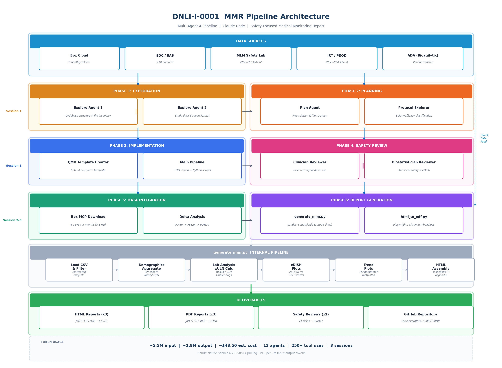

# DNLI-I-0001 Medical Monitoring Report (MMR)

Safety-focused Medical Monitoring Report template and pipeline for clinical study **DNLI-I-0001** (DNL-126), generated using a multi-agent AI pipeline built on Claude Code.

## Study Overview

| Item | Value |
|------|-------|
| **Study** | DNLI-I-0001 |
| **Drug** | DNL-126 (ETV:SGSH-BioM) |
| **Indication** | MPS IIIA (Sanfilippo Syndrome Type A) |
| **Phase** | Phase 1/2 |
| **Protocol** | Version 6 (26-Aug-2025) |
| **Subjects** | N=20 across 4 cohorts (4 sites) |
| **Data Cut** | 2026-02-25 (EDC) |
| **Report Date** | 2026-04-12 |

### Cohort Structure

| Cohort | N | Dose Schedule (Protocol V6) |
|--------|---|----------------------------|
| A1 | 4 | 3 mg/kg QW Wks 1-2, then 10 mg/kg Q2W |
| A2 | 4 | 3 mg/kg QW Wks 1-2, then escalate 3 to 6 to 10 mg/kg |
| A3 | 10 | 3 mg/kg QW x6 doses, 6 mg/kg QW x6 doses, 10 mg/kg QW |
| B1 | 2 | 3 mg/kg QW x6 doses, 6 mg/kg QW x6 doses, 10 mg/kg QW |

## Report Sections

1. **Study Status** - Enrollment, disposition, screen failures, current status
2. **Baseline Characteristics** - Demographics, disease baseline (SGSH mutation, ADA, organ volumes)
3. **Study Conduct** - Protocol deviations, dosing compliance, assessment availability
4. **Study Drug Exposure & Immunogenicity** - Exposure plots, compliance profiles, ADA summary
5. **Adverse Events** - TEAEs, IRRs (442 cumulative events), SAEs, AESIs
6. **Safety Laboratory** - Biochemistry, hematology, immune biomarkers, urine chemistry, eDISH
7. **ECG Summary** - QTcF, QRS, HR trend plots with outlier indicators
8. **Vital Signs** - SBP, DBP, pulse, SpO2, temperature (pre-dose, by cohort)

### Data Exclusions

Per Protocol V6 Section 9.1, the following **efficacy data** are excluded from this safety report:
- CSF Heparan Sulfate (primary efficacy endpoint)
- Serum NfL (secondary efficacy endpoint)
- Clinical Outcome Assessment results (KABC, VABS-III, BSID III/IV - exploratory efficacy)

**Urine HS** is included per medical monitor direction. COA **collection compliance** (whether assessed per SOA) is tracked, but actual results are not shown.

## Key Safety Findings

### Clinician Safety Review ([full report](docs/clinician-safety-review.md))

**Overall Benefit-Risk: Favorable**

| Domain | Risk Level | Key Signal |
|--------|-----------|------------|
| IRR | **MEDIUM-HIGH** | 442 events, 75% moderate-severe, 1 anaphylactic reaction (B1) |
| AE/SAE Pattern | MEDIUM | 15 SAEs in 13/20 participants; 0017-9004 has 4 SAEs (highest burden) |
| Immunogenicity/ADA | MEDIUM | 95% ADA+, 60% neutralizing; correlates with IRR severity |
| Hepatotoxicity (eDISH) | LOW | 0/20 ALT >3xULN, 0/20 TBILI >1.5xULN |
| ECG | LOW | QTcF >450ms in 3/20 -- single observations, IRR-related |

### Biostatistician Safety Review ([full report](docs/biostatistician-safety-review.md))

| Domain | Key Finding |
|--------|------------|
| IRR Rates | Exposure-adjusted: A3 66.2 vs A1 27.6 per 100 person-wks -- consistent with time-dependent decline |
| eDISH Validation | Confirmed clean; max xULN values not reported (data gap for safety margin quantification) |
| Small Sample Power | Min detectable AE rate: 7.8% (N=20), 33% (N=4); drug-related SAE 95% CI: 0.1--24.9% |
| Data Completeness | Visit-level completion rates not available; lab data lag of 12 days before cut |

## AI Pipeline

This report was generated using a multi-agent pipeline in [Claude Code](https://claude.ai/claude-code). See [pipeline metadata](docs/pipeline-metadata.md) and [token consumption tracker](docs/token-consumption-tracker.md) for full details.

### Architecture & Data Pipeline



> **[Open in Excalidraw](docs/mmr-pipeline-architecture.excalidraw)** for interactive editing

### Agent Phases

| Phase | Agents | Task |
|-------|--------|------|
| 1. Exploration | 2 Explore agents (parallel) | Codebase structure, study data extraction |
| 2. Planning | Plan + Protocol Explorer | Repo design, efficacy/safety classification from Protocol V6 |
| 3. Implementation | QMD Creator + Main Pipeline | Safety-only QMD template (5,376 lines), HTML report (6.6 MB), scripts |
| 4. Review | Clinician + Biostatistician (parallel) | Safety signal detection across all 8 report sections |
| 5. Data Integration | Box Download + Delta Analysis | 6 CSV files (3 months), monthly delta comparison |
| 6. Report Generation | MMR Generator + PDF Pipeline | Template-matched reports for JAN/FEB/MAR 2026 |

### Token Usage

| Session | Tokens (Input) | Tokens (Output) | Cost (est.) | Work Done |
|---------|---------------|-----------------|-------------|-----------|
| Session 1: Initial Pipeline | ~2.5M | ~800K | ~$19.50 | Safety-only template, HTML report, clinician + biostatistician reviews, GitHub repo |
| Session 2: Data Integration | ~1.5M | ~500K | ~$12.00 | Box data download (6 CSVs), delta analysis, MMR generator v1, 3 HTML + 3 PDF reports |
| Session 3: Template Alignment | ~1.5M | ~500K | ~$12.00 | MMR generator v2 (template-matched), 3 HTML + 3 PDF final reports, token tracker |
| **Total** | **~5.5M** | **~1.8M** | **~$43.50** | **Full pipeline: raw data → validated safety MMR** |

*Note: Token estimates are approximate. Actual usage depends on context window utilization and conversation length. Cost based on Claude claude-sonnet-4-20250514 pricing ($3/$15 per 1M input/output tokens).*

## Repository Structure

```
DNLI-I-0001-MMR/
+-- report/             # Generated safety-only HTML report (6.6 MB)
+-- qmd/                # R/Quarto template (safety-only, 5,376 lines)
+-- scripts/            # Python figure generation and PDF pipeline
|   +-- legacy/         # Earlier script iterations (reference)
+-- data/               # Clinical data inputs (not committed)
+-- output/             # Generated artifacts (not committed)
+-- docs/               # Safety reviews and pipeline metadata
|   +-- clinician-safety-review.md
|   +-- biostatistician-safety-review.md
|   +-- pipeline-metadata.md
+-- config.yaml         # Study metadata and path configuration
+-- requirements.txt    # Python dependencies
```

## Prerequisites

### R/Quarto Pipeline
- R >= 4.3
- Quarto >= 1.4
- Key R packages: haven, tidyverse, admiral, tern, rtables, ggplot2, gt, patchwork
- XeLaTeX (for PDF rendering)

### Python Pipeline
- Python >= 3.10
- Install: `pip install -r requirements.txt`

## Quick Start

### Option A: R/Quarto (full report from raw data)
1. Place clinical data in `data/edc/` and vendor files in `data/`
2. Place `I1 Specs.xlsx` in `documents/`
3. `cd qmd && quarto render I-0001-Medical-Monitoring-Report-PDF.qmd`

### Option B: Python (figure generation + HTML/PDF assembly)
1. Update `config.yaml` with paths for the current data cut
2. `python scripts/gen_corrected_figs.py`
3. `python scripts/rebuild_mmr.py`
4. `python scripts/gen_mmr_pdf.py`

## New Data Cut

1. Update data cut dates in `config.yaml`
2. Place new data extracts in `data/`
3. Re-run pipeline (Option A or B)

## Safety Review

After generating the report, clinician and biostatistician review agents can be launched to perform safety signal detection focused on:
- AE/SAE emerging patterns and IRR severity trends
- Lab outlier identification and hepatotoxicity screening (eDISH)
- ECG/vital signs anomalies
- Dose-exposure and ADA-safety correlations
- Data completeness and statistical adequacy
